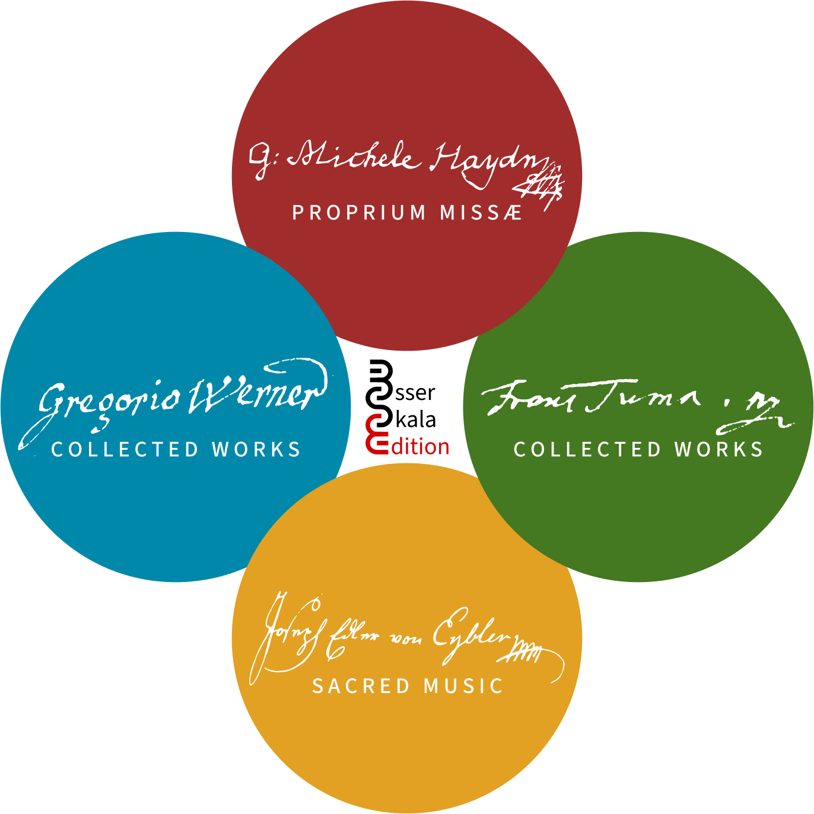

The Edition Esser-Skala publishes [Open Content](https://opendefinition.org/od) editions of (mainly) 18th century sacral music. Since our mission is to preserve this cultural heritage, all scores may be freely downloaded. Selected titles are also available in print from Kindle Direct Publishing.

::: {.callout-note}
Our scores *will always remain free and open*. Nevertheless, to be able to continue our publishing efforts, we appreciate your *support*, e.g. via publishing commissions, performance license agreements, or donations ([PayPal](https://paypal.me/esserskala), [bank transfer](contact.qmd)).
:::

Currently, our focus lies on the following composers:

Gregor Joseph Werner
: We offer editions of Werner’s [music](scores/werner.qmd). Concurrently, we are working on a [catalogue](https://gregor-joseph-werner.at) of his works.

František Ignác Antonín Tůma
: We are working on a [collected edition](scores/tuma.qmd) of Tůma’s compositions, as well as on a [catalogue](https://frantisek-tuma.at) of his works.

Joseph Leopold Eybler
: We are working on a [complete edition](scores/eybler.qmd) of Eybler's sacral music, including his masses and short liturgical works.

Johann Michael Haydn
: Our [editions](scores/haydn.qmd) include litanies, vespers, and cantatas. Moreover, the Proprium Missæ project represents a comprehensive collection of short liturgical works.

{alt-text="Core projects (Eybler, Haydn, Tůma, Werner)"}

But don't miss out our other editions, which include several highlights, such as

- the *Missa Providentiæ* by Antonio [Caldara](scores/caldara.qmd), which includes a *Credo* by Jan Dismas Zelenka (ZWV 31)
- a reissue of the *Wohlgeübter Organist* by Johann Anton [Kobrich](scores/kobrich.qmd), a collection of preludes, fugues, and toccatas that was first printed in the 1760s
- a bilingual (Danish/German) edition of Friedrich Ludwig Æmilius [Kunzen](scores/kunzen.qmd)'s *Skabningens Halleluja* (*Das Halleluja der Schöpfung*)
- … and many more!

To ensure high and consistent quality, we follow a set of [editorial guidelines](editorial-guidelines.qmd) when preparing our editions. Moreover, we have implemented a largely automated engraving and publishing process. Briefly, this workflow encompasses

- beautiful scores engraved by [LilyPond](https://lilypond.org),
- prefatory material typeset with [LaTeX](https://www.latex-project.org/), and
- compilation of editions via [GitHub Actions](https://github.com/features/actions) and a [Docker](https://www.docker.com/) container to ensure reproducibility.

Details on the workflow are available in the comprehensive [technical documentation](technical-documentation.qmd).
